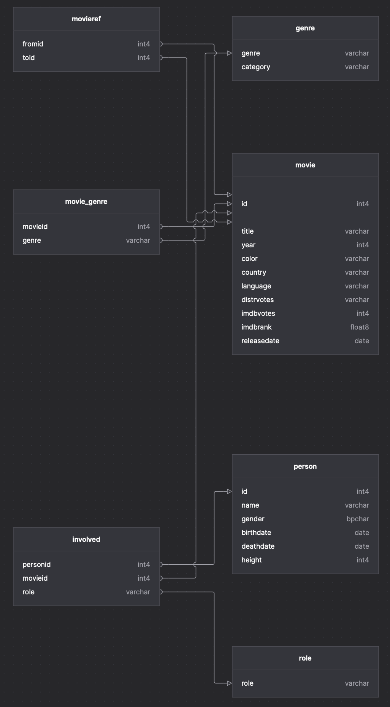

# db_halvfabrikata

Alt halvfabrikate er sorteret i de forskellige tematiske mapper (Subqueries, division queries, etc.)

Alle queries er baseret på databasen ddl.sql (homework 1).
_ER-Diagram:_

Opsætning af db:

1. Lav en tom database:

   `createdb -U postgres <databaseNavn>`

   (`postgres` kan skulle erstattes af navnet på din bruger)

2. Pipe ddl.sql ind i databasen:

   `psql -U postgres -q <databaseNavn> < ddl.sql`

   (`postgres` kan skulle erstattes af navnet på din bruger)

   - Alternativt kan man tilgå psql `psql -U` og derefter vælge en database `\c <databaseNavn>`
   - `\l` returnerer en liste over alle databaser på servereren

### Brugbare kommandoer:

- Slet database: `dropdb -U postgres <databaseNavn>`

  (`postgres` kan skulle erstattes af navnet på din bruger)
